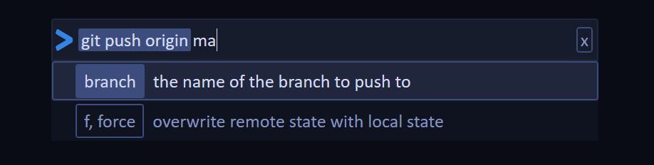

# The CLUI
## Build: v0.6.0 (MVP)

The CLUI is a unified command system for the web inspired by the project built by [replit](https://docs.replit.com/misc/clui). The CLUI has the speed of a CLI while having the convenience of a UI.

Instead of fumbling through CLI documentation, spend more time running commands by using the CLUI's integrated form system to easily understand and fill out parameters and arguments. Adding a reactive command line to your website is as easy as including a plugin and adding commands!

*Open to contributions, just email me at vandesm14@gmail.com, DM me on [Twitter](https://twitter.com/vandesm14), or find me on [Discord](https://discord.gg/UKQUkhjxRT)*

# Changelog
## [5/9/2021](https://github.com/Vandesm14/clui/tree/40aba6e84cc6f4d10bd3f73beb0abd596c71ede1)
- Fully add pages, forms, and run functions

## [5/8/2021](https://github.com/Vandesm14/clui/tree/ce628ed1ce32745b73952360288bf7968c8378e2)
- Simple page rendering
  - Styled page items
- Fix toast system and a few functions

## [5/7/2021](https://github.com/Vandesm14/clui/tree/31dfb4c579b28d1c6bc329cb4c473c8efd885b7f)
- Refactor command setup
  - Change `Command.description` to `Command.desc`
- Add pages
- Major style updates
- Squash a few bugs

## [5/3/2021](https://github.com/Vandesm14/clui/tree/b057e41aaff590bbf7c9bee1ec3d8630244eed22)
- Add typescript

## [4/26/2021](https://github.com/Vandesm14/clui/tree/cca21da1247e30ac200bb9c6c7d237e754116ba4)
- Add toast system
- Add selection system (dropdown)
- Add README