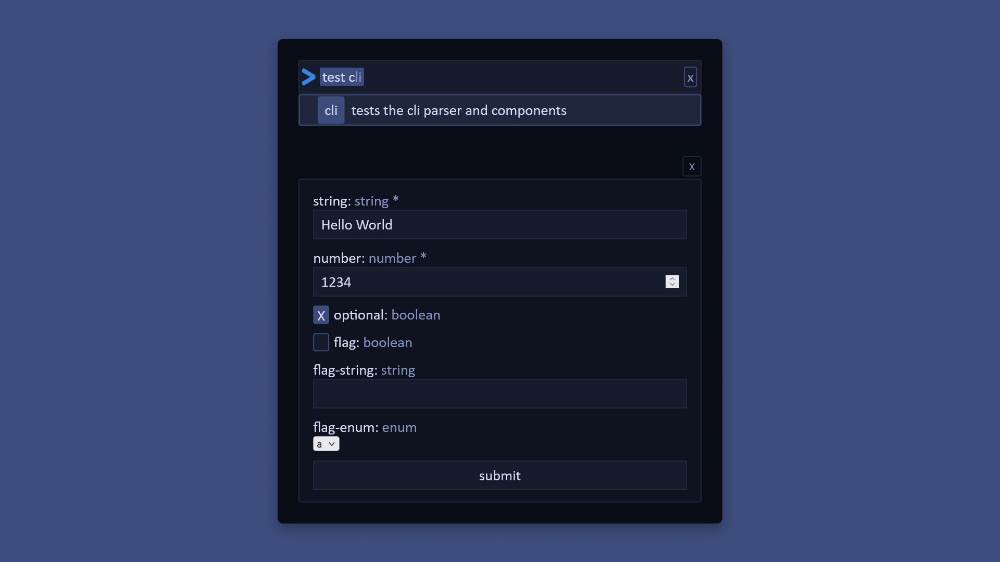

# The CLUI
<!-- ## Build: [Pre-Alpha](CHANGELOG.md) -->

<!--  -->

<!-- ### [Demo](https://vandesm14.github.io/clui/) -->

The CLUI is a unified command system for the web inspired by the project built by [replit](https://docs.replit.com/misc/clui). The CLUI has the speed of a CLI while having the convenience of a UI.

Instead of fumbling through CLI documentation, spend more time running commands by using the CLUI's integrated form system to easily understand and fill out parameters and arguments. Adding a reactive command line to your website is as easy as including a plugin and adding commands!

**Open to contributions, just email me at vandesm14@gmail.com, find me on [Discord](https://respdev.com/discord), or open an issue/PR**

## Update (v3)

This is the 3rd iteration of the CLUI. It went from a simple vanilla JS & HTML app to now a fully-fledged stateless & functional API!

## Features

The CLUI isn’t just a command system, it’s a workflow. It’s time to speed up your tasks with the [Intelligent CLI](#intelligent-cli), [Interactive GUI](#interactive-gui), and [Seamless Integration](#seamless-integration). The CLUI allows you to focus on your work without wasting time reading command docs.

### Intelligent CLI

The Intelligent CLI is the best option when it comes to input. Forget steep learning curves, the CLUI can easily work with any skill level with it’s highly customizable behavior.

### Interactive GUI

[PLACEHOLDER]

### Seamless Integration

No GUI? No problem! Enjoy the functionality of the CLUI using the barebones API! It's now possible integrate the CLUI essentially *anywhere* without relying on a web-based script or interface!.